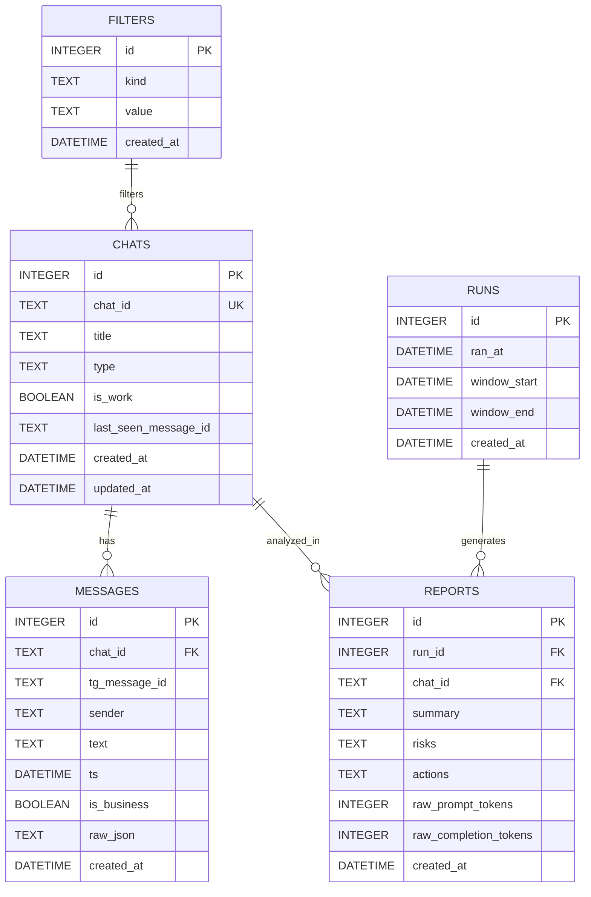

# Схема базы данных SQLite

## Диаграмма ER



## Описание таблиц

### CHATS - Чаты
Хранит информацию о всех чатах, с которыми взаимодействует бот.

| Поле | Тип | Описание |
|------|-----|----------|
| `id` | INTEGER PRIMARY KEY | Автоинкрементный ID |
| `chat_id` | TEXT UNIQUE | Уникальный ID чата в Telegram |
| `title` | TEXT | Название чата или имя пользователя |
| `type` | TEXT | Тип чата (private, group, supergroup, channel) |
| `is_work` | BOOLEAN | Флаг рабочего чата (определяется фильтрами) |
| `last_seen_message_id` | TEXT | ID последнего обработанного сообщения |
| `created_at` | DATETIME | Время создания записи |
| `updated_at` | DATETIME | Время последнего обновления |

**Индексы:**
- `chat_id` (уникальный)
- `is_work` (для быстрого поиска рабочих чатов)

### MESSAGES - Сообщения
Хранит все сообщения из всех чатов для последующего анализа.

| Поле | Тип | Описание |
|------|-----|----------|
| `id` | INTEGER PRIMARY KEY | Автоинкрементный ID |
| `chat_id` | TEXT FK | Ссылка на чат |
| `tg_message_id` | TEXT | ID сообщения в Telegram |
| `sender` | TEXT | Имя отправителя |
| `text` | TEXT | Текст сообщения |
| `ts` | DATETIME | Время отправки сообщения |
| `is_business` | BOOLEAN | Флаг бизнес-сообщения |
| `raw_json` | TEXT | Полный JSON сообщения для отладки |
| `created_at` | DATETIME | Время создания записи |

**Индексы:**
- `chat_id` (для группировки по чатам)
- `ts` (для временных запросов)
- `is_business` (для фильтрации)

**Внешние ключи:**
- `chat_id` → `CHATS.chat_id`

### RUNS - Запуски анализа
Записывает информацию о каждом запуске анализа для трекинга.

| Поле | Тип | Описание |
|------|-----|----------|
| `id` | INTEGER PRIMARY KEY | Автоинкрементный ID |
| `ran_at` | DATETIME | Время запуска анализа |
| `window_start` | DATETIME | Начало временного окна |
| `window_end` | DATETIME | Конец временного окна |
| `created_at` | DATETIME | Время создания записи |

**Использование:**
- Трекинг производительности
- Отладка временных окон
- Статистика запусков

### REPORTS - Отчеты анализа
Хранит результаты анализа каждого чата от GPT.

| Поле | Тип | Описание |
|------|-----|----------|
| `id` | INTEGER PRIMARY KEY | Автоинкрементный ID |
| `run_id` | INTEGER FK | Ссылка на запуск анализа |
| `chat_id` | TEXT FK | Ссылка на чат |
| `summary` | TEXT | Договоренности (JSON строка) |
| `risks` | TEXT | Риски (JSON строка) |
| `actions` | TEXT | Рекомендации (JSON строка) |
| `raw_prompt_tokens` | INTEGER | Количество токенов в промпте |
| `raw_completion_tokens` | INTEGER | Количество токенов в ответе |
| `created_at` | DATETIME | Время создания записи |

**Индексы:**
- `run_id` (для группировки отчетов по запуску)
- `chat_id` (для истории по чату)

**Внешние ключи:**
- `run_id` → `RUNS.id`
- `chat_id` → `CHATS.chat_id`

### FILTERS - Фильтры
Хранит правила фильтрации чатов и сообщений.

| Поле | Тип | Описание |
|------|-----|----------|
| `id` | INTEGER PRIMARY KEY | Автоинкрементный ID |
| `kind` | TEXT | Тип фильтра (allow_chat, deny_chat, keyword) |
| `value` | TEXT | Значение фильтра |
| `created_at` | DATETIME | Время создания записи |

**Типы фильтров:**
- `allow_chat`: ID чата в allowlist
- `deny_chat`: ID чата в denylist  
- `keyword`: Ключевое слово для определения рабочих сообщений

**Индексы:**
- `kind` (для быстрого поиска по типу)

## Примеры запросов

### Получение новых сообщений за час
```sql
SELECT m.*, c.title, c.is_work, c.type
FROM messages m
JOIN chats c ON m.chat_id = c.chat_id
WHERE m.ts >= datetime('now', '-1 hour')
  AND m.ts < datetime('now')
ORDER BY m.ts ASC;
```

### Статистика по чатам
```sql
SELECT 
    c.chat_id,
    c.title,
    c.is_work,
    COUNT(m.id) as messages_count,
    MAX(m.ts) as last_message
FROM chats c
LEFT JOIN messages m ON c.chat_id = m.chat_id
GROUP BY c.chat_id, c.title, c.is_work
ORDER BY messages_count DESC;
```

### Отчеты за последние 7 дней
```sql
SELECT 
    r.run_id,
    r.chat_id,
    c.title,
    r.summary,
    r.risks,
    r.actions,
    run.ran_at
FROM reports r
JOIN runs run ON r.run_id = run.id
JOIN chats c ON r.chat_id = c.chat_id
WHERE run.ran_at >= datetime('now', '-7 days')
ORDER BY run.ran_at DESC;
```

### Активные фильтры
```sql
SELECT 
    kind,
    COUNT(*) as count,
    GROUP_CONCAT(value, ', ') as values
FROM filters
GROUP BY kind
ORDER BY kind;
```

### Производительность анализа
```sql
SELECT 
    DATE(ran_at) as date,
    COUNT(*) as runs_count,
    AVG(total_tokens) as avg_tokens,
    SUM(total_tokens) as total_tokens
FROM runs r
JOIN (
    SELECT run_id, SUM(raw_prompt_tokens + raw_completion_tokens) as total_tokens
    FROM reports
    GROUP BY run_id
) tokens ON r.id = tokens.run_id
WHERE ran_at >= datetime('now', '-30 days')
GROUP BY DATE(ran_at)
ORDER BY date DESC;
```

## Оптимизация

### Индексы
- Все внешние ключи проиндексированы
- Временные поля (`ts`, `ran_at`) для быстрых запросов
- Булевые поля (`is_work`, `is_business`) для фильтрации

### Размер таблиц
- **CHATS**: ~1000 записей (максимум чатов)
- **MESSAGES**: ~100,000 записей (100 сообщений/день × 1000 дней)
- **RUNS**: ~25,000 записей (24 запуска/день × 1000 дней)
- **REPORTS**: ~50,000 записей (2 отчета/запуск)
- **FILTERS**: ~100 записей (пользовательские правила)

### Очистка данных
```sql
-- Удаление старых сообщений (старше 1 года)
DELETE FROM messages 
WHERE ts < datetime('now', '-1 year');

-- Удаление старых запусков (старше 6 месяцев)
DELETE FROM runs 
WHERE ran_at < datetime('now', '-6 months');

-- Обновление статистики
VACUUM;
ANALYZE;
```

## Миграции

### Версия 1.0 (MVP)
- Базовая схема с 5 таблицами
- Индексы для производительности
- Ограничения внешних ключей

### Будущие версии
- Таблица `users` для многопользовательского режима
- Таблица `themes` для категоризации
- Таблица `integrations` для внешних сервисов
- Партиционирование по датам для больших объемов
